# 페이스북 개발자 셋업

## 내 앱으로 이동

[페이스북 개발자 사이트](https://developers.facebook.com/) 로 이동합니다.
로그인하지 않았다면 로그인을 먼저 진행한다.

로그인 후, [내 앱](https://developers.facebook.com/apps/) 메뉴를 눌러 이동한다.

## 새 앱 생성
기존의 앱을 재활용하면, 이 단계를 건너뛰어도 됩니다.

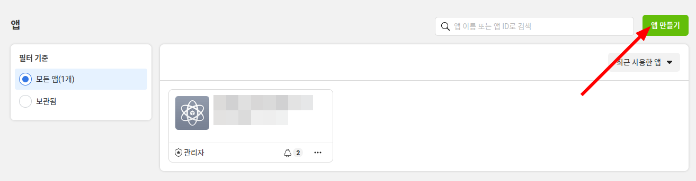

위 그림에서 처럼 '앱 만들기' 버튼을 클릭하여 신규 앱을 생성합니다.

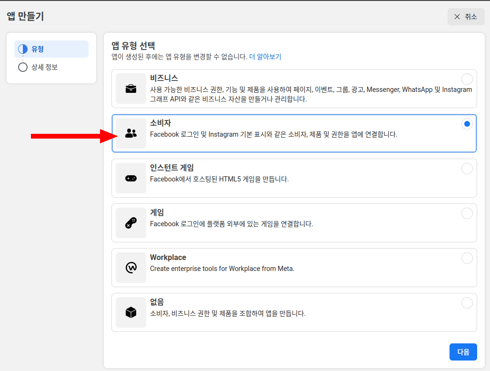

앱 유형을 물어봅니다.
소셜 로그인을 위해 사용자 정보가 필요하므로 '소비자'를 선택하고, '다음' 버튼을 클릭합니다.

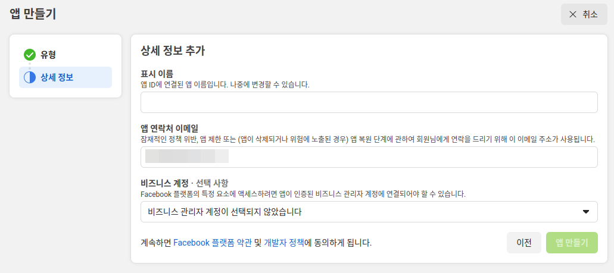

상세 정보를 추가합니다.
* 앱 이름은 적절히 짓습니다. 이 예제에서는 'naran-social-login'을 사용합니다.
* 이메일은 미리 입력되어 있거나, 없으면 입력합니다.
* 비즈니스 계정은 선택하지 않아도 됩니다.

'앱 만들기' 버튼을 클릭합니다.
비밀번호를 입력하라는 창이 뜰 수 있습니다.
자신의 비밀번호를 정확히 입력하여 다음 단계로 진행합니다.

## 앱에 제품 추가
기존의 제품 설정을 그대로 재활용하면, 이 단계를 건너뛰어도 됩니다.

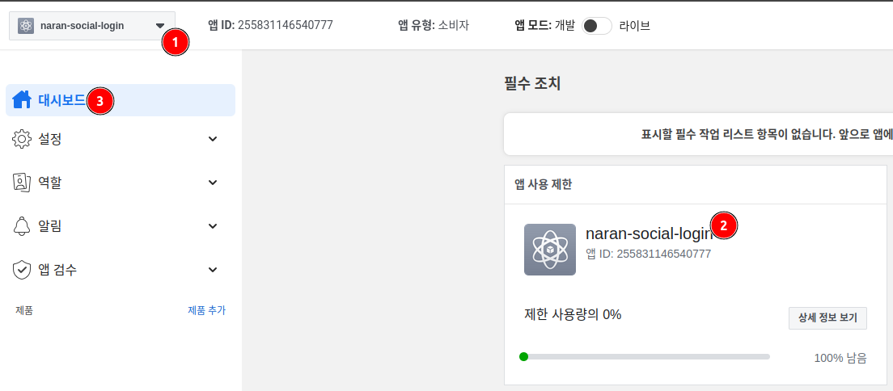

그림의 (1), (2)를 확인하여 사용하려는 앱이 'naran-social-login'로 정확한지 확인합니다.
정확하지 않으면 (1)의 선택 상자를 이동하여 이동하고, 정확하면 (3)과 같이 대시보드 메뉴를 클릭합니다.

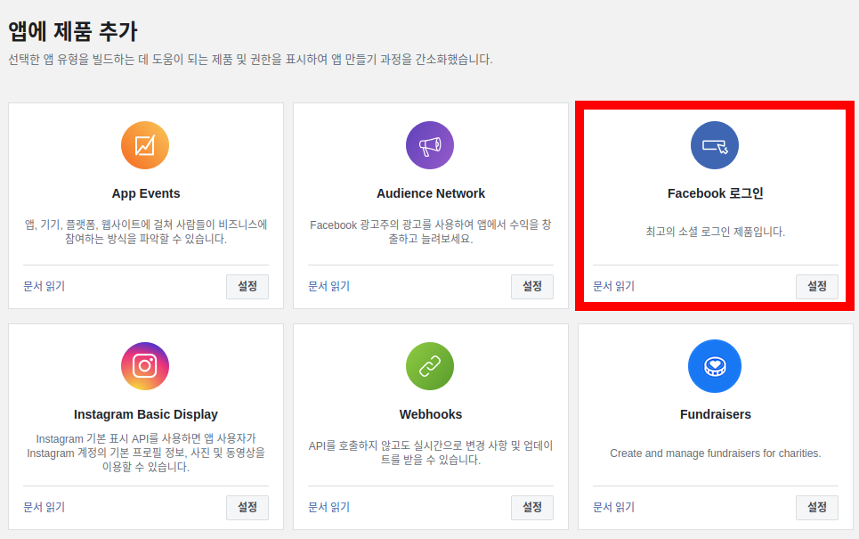

'앱에 제품 추가' 섹션으로 이동합니다. 그리고 그림에서 붉은색 사각형으로 표시한 'Facebook 로그인'
부분의 '설정' 버튼을 클릭합니다.

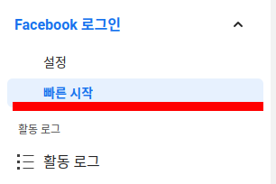

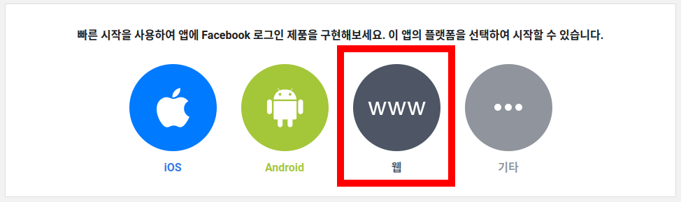

좌측 메뉴에서 '빠른 시작'이 선택되어 있는지 확인하고, 그렇지 않다면 클릭하여 해당 메뉴로 이동합니다.
빠른 시작으로 이동하면, 위 그림처럼 플랫폼을 선택하라는 화면이 나옵니다. 여기서는 '웹'을 선택합니다.

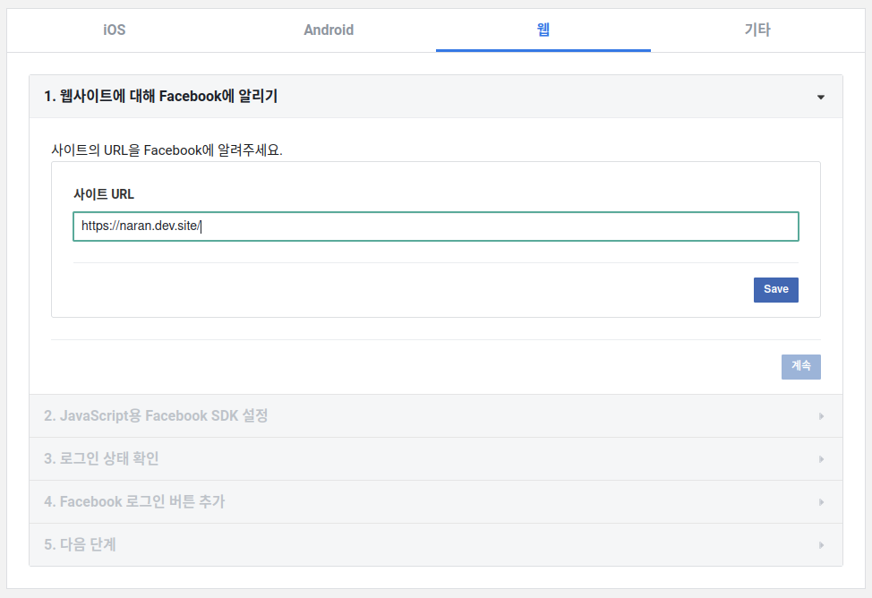

우선 사이트 URL을 입력해야 합니다. 
이 예제에서는 'https://naran.dev.site'를 사용합니다.
각자 세팅하려는 사이트의 URL을 https 부터 정확히 입력하세요.
'Save' 버튼을 누르면, '계속' 버튼을 눌러 다음으로 진행할 수 있습니다.

나머지는 크게 중요하지 않습니다. 끝까지 계속을 눌러 진행하시면 됩니다.

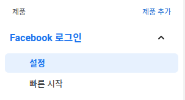

이제 'Facebook 로그인'의 설정 메뉴로 이동합니다.

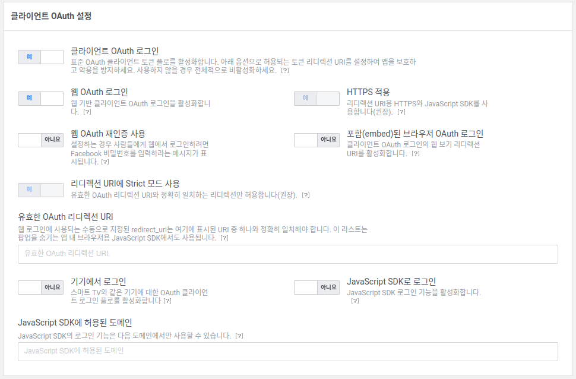

위 그림처럼 셋팅을 처리합니다.

유효한 OAuth 리다이렉션 URI에, 관리자 > 설정 > 나란 소셜 로그인 > Facebook Redirect URI 부분을 복사하여
여기에 붙여넣기합니다. 화면 하단의 '변경 내용 저장' 버튼을 눌러 작업을 완료합니다.

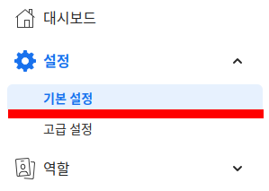

이제 설정 > 기본 설정 메뉴로 이동합니다.

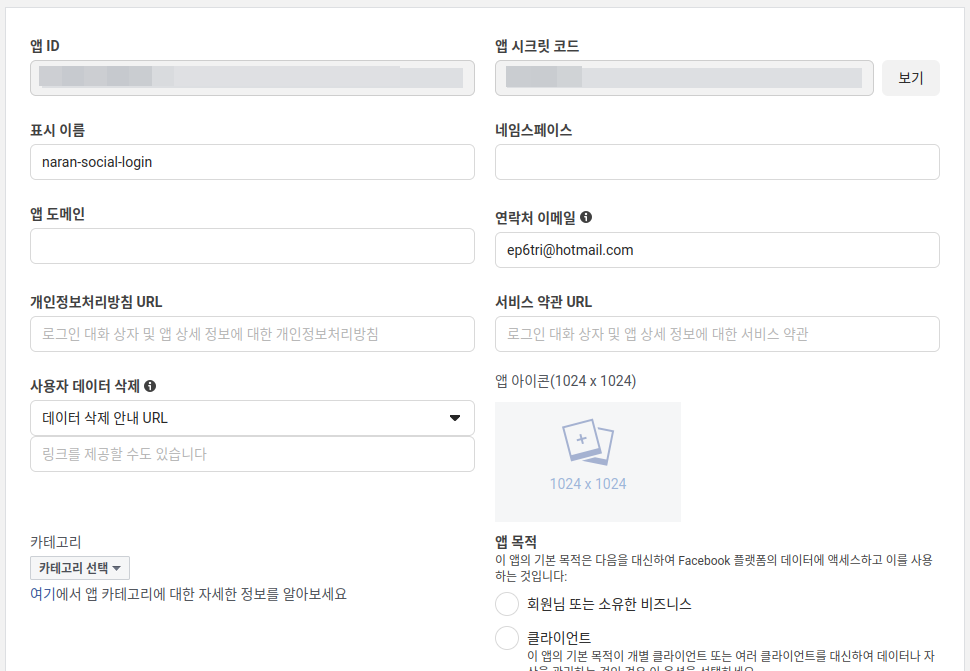

위 그림처럼 앱 ID, 앱 시크릿 코드가 보일 것입니다.
앱 시크릿 코드 옆의 '보기' 버튼을 눌러 시크릿 코드를 노출합니다.
이 때 비밀번호를 물어볼 수 있습니다. 정확힌 비밀번호를 입력하여 진행합니다.

앱 ID와 앱 시크릿 코드를 각각 복사하여,
관리자 > 설정 > 나란 소셜 로그인 > Facebook > 앱 ID, 앱 시크릿 코드에 각각 붙여넣습니다.

이로서 페이스북 소셜 로그인을 위한 최소한의 설정이 완료되었습니다.
이후 사이트의 개발이 완료되면 앱 모드를 '개발'에서 '라이브'로 변경하는 것을 잊지 마십시오.
