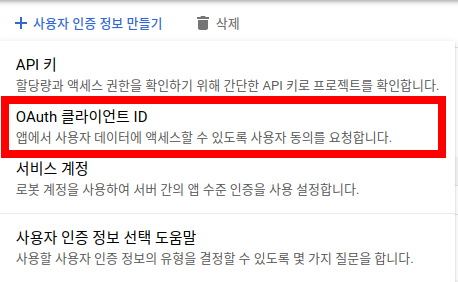

# 구글 개발자 셋업

[구글 클라우드 플랫폼 사이트](https://console.cloud.google.com/) 방문.
로그인하지 않았다면 로그인을 먼저 진행합니다.

여러 구글 계정을 가진 분은 우측 상단 프로필 아이콘을 클릭하여 원하는 계정으로 선택되었는지
확인합니다. 예를 들어, 위 그림은 웹브라우저에 2개의 서로 다른 구글 계정의로 로그인한 이력이 있는 경우를 보여줍니다.

(1)이 현재 선택된 계정, (2)는 전환할 수 있는 다른 계정을 의미합니다. (2)를 선택하면 새 탭에 해당 계정의 콘솔로 이동합니다.

## 프로젝트 생성

[리소스 관리](https://console.cloud.google.com/cloud-resource-manager) 페이지로 이동합니다. 
좀 더 간단하게 화면 좌측 상단에 프로젝트를 이동할 수 있는 드롭다운에서 프로젝트를 선택할 수도 있습니다.

'프로젝트 만들기'를 눌러 새로운 프로젝트를 생성합니다.

여기서는 프로젝트 이름을 'naran-social-login'으로 정합니다. 각자 알아보기 쉬운 이름을 정하셔도 됩니다.
'만들기' 버튼을 눌러 생성을 완료합니다.

완료되면, 리소스 관리로 돌아옵니다. 프로젝트가 생성되었는지 확인합니다.
조직 부분이 접혀 있으면 프로젝트가 보이지 않을 수 있으니 클릭하여
화살표로 가리킨 부분처럼 펼쳐 보시기 바랍니다.

이제 메뉴 > 홈 > 대시보드로 이동합니다.

여기서 위 그림처럼 (1)을 누르면 프로젝트 선택 창이 열립니다.
(2)를 클릭하면 프로젝트로 이동합니다.

## 프로젝트 설정

### 설정 1: OAuth 동의 화면

위 그림처럼 프로젝트가 정확히 선택되었는지 확인합니다.

프로젝트를 확인하였으면 메뉴 > API 및 서비스 > OAuth 동의 화면으로 이동합니다.

OAuth 동의 화면 설정에서 대상 사용자를 설정합니다. '외부'를 선택합니다.
'만들기' 버튼을 눌러 다음으로 진행합니다.

위 그림처럼 이 예시에서는 '앱 이름'은 'Naran Social Login'으로 하였습니다. 
웹사이트의 방문자들이 혼동하지 않도록 각자의 이름으로 하시는 것이 좋습니다.

이메일을 필수이므로 반드시 입력합니다.

앱 로고도 입력하는 것이 좋습니다만, 여기서는 생략합니다.

위 그림과 같이 나머지 부분을 모두 입력합니다.

애플리케이션 홈페이지에는 운영하시는 홈페이지의 URL을 적습니다. 이 예제에서는 'https://naran.dev.site'를 입력합니다.
개인정보처리방침 링크와 애플리케이션 서비스 약관 링크는 여기서는 생략합니다. 승인시에는 필요할 수 있습니다.

이 예제에서는 승인된 도메인에 'dev.site'를 입력하였습니다. https:// 같은 부분은 제외하고 입력합니다.
예를 들어, 웹사이트가 'https://my.shop.co.kr'이면 'shop.co.kr'만 입력하시면 됩니다.

'저장 후 계속' 버튼을 눌러 진행합니다.

### 설정 2: 범위

이제 앱 등록 수정, (2) 범위 화면에 있습니다. '범위 추가 또는 삭제' 버튼을 눌려 범위를 지정합니다.

버튼을 누르면 위 그림과 같은 화면이 나옵니다. 여기서 그림처럼 `.../auth/userinfo.email`, `.../auth/userinfo.profile`
두가지만 선택합니다. 굳이 많은 권한을 잡을 필요가 없습니다.

화면을 스크롤해 내려 '업데이트' 버튼을 찾습니다. 버튼을 눌러 저장합니다.

'민감하지 않은 범위'에 선택한 사항이 반영된 것을 볼 수 있습니다.
'저장 후 계속' 버튼을 눌러 다음으로 진행합니다.

### 설정 3: 테스트 사용자

이제 앱 등록 수정 (3) 테스트 사용자 화면에 있습니다.
앱의 로그인 테스트를 위해 추가적인 사용자를 지정할 수 있습니다. 'Add Users' 버튼을 눌러 적절히 사용자를 추가합니다.

여기서는 이 단계는 생략하겠습니다. 설정이 완료되었으면 '저장 후 계속' 버튼을 눌러 진행합니다.

### 설정 4: 요약

지금까지 설정한 내용이 요약되어 표시됩니다. 혹시 정확하지 않은 정보가 있다면 '수정' 버튼을 눌러 수정하십시오.
모든 사항이 정확하면 '대시보드로 돌아가기' 버튼을 눌러 대시보드로 이동합니다.

### 인증 정보 확득

위 그림 (1)처럼 지금까지 생성중인 'naran-social-login' 앱인지 확인합니다.

(2)처럼 '사용자 인증 정보' 메뉴에 있는지 확인합니다.

(1), (2)가 만족되엇다면 (3) '사용자 인증 정보 만들기'를 눌러 새 인증 정보를 생성합니다.

그러면 위 그림처럼 드롭다운이 생기는데, 여기서 'OAuth 클라이언트 ID'를 선택합니다.

잠시 대기하고 나면 위 그림처럼 애플리케이션 유형을 묻는 화면이 나옵니다.
여기서 '웹 애플리케이션'을 선택합니다.

'웹 애플리케이션'을 선택하면 위 그림처럼 추가적인 폼이 생성됩니다.

(1)은 이 OAuth2.0을 알아보기 위한 이름을 짓는 부분입니다. 알아보기 쉽게 이름을 지으면 됩니다. 여기서는 'naran-social-login'으로
지정하였습니다. 각자 편한 이름으로 지으시면 됩니다.

(2)에는 리다이렉션 URI를 입력합니다.
이것은 워드프레스 관리자 > 설정 > Naran Social Login > Services > Credentials > Google 에서
'Redirect URI' 부분을 복사해 여기에 붙여 넣습니다.

정확하게 복사해 봍여 넣었다면, (3) '만들기' 버튼을 눌러 다음으로 진행합니다.

잠시 대기하면 위 그림처럼 인증 정보가 생성됩니다. 클라이언트 ID와 클라이언트 보안 비밀번호를
워드프레스 관리자 > 설정 > Naran Social Login > Servics > Credentials > Google 의
API Key, API Secret 부분에 각각 복사, 붙여넣기 합니다.

확인 버튼을 눌러 창을 닫습니다.

위 그림처럼 인증 정보가 생성되어 있을 것입니다.

이름을 클릭하면 OAuth2.0 클라이언트 상세 정보를 볼 수 있습니다.
여기서 클라이언트 ID와 클라이언트 보안 비밀을 다시 확인할 수 있습니다.

1. (1)처럼 프로젝트가 정확히 선택되어 있는지 확인합니다.
2. (2)처럼 API 및 서비스 > 사용자 인증 정보 메뉴를 선택하고, 원하는 OAuth2.0 클라이언트를 클릭하여
   세부 페이지로 접근하였는지 확인합니다.
3. 클라이언트 ID, 보안 비밀은 (3)에서 언제든지 확인 가능합니다.
4. (4)의 리다이렉션 URI가 정확히 워드프레스 설정에서 복사, 붙여넣기 되었는지 확인합니다.
5. 수정할 사항이 있다면 재차 수정을 거친 후, (5) '저장' 버튼을 눌러 저장합니다.
