# 카카오 개발자 셋업

[카카오 개발자](https://developers.kakao.com/) 사이트로 이동합니다.
로그인하지 않았다면 로그인 합니다.

## 애플리케이션 만들기

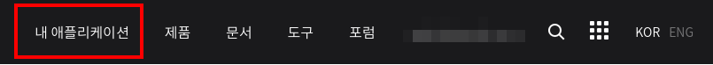

메뉴 '내 애플리케이션'을 클릭해 이동합니다.

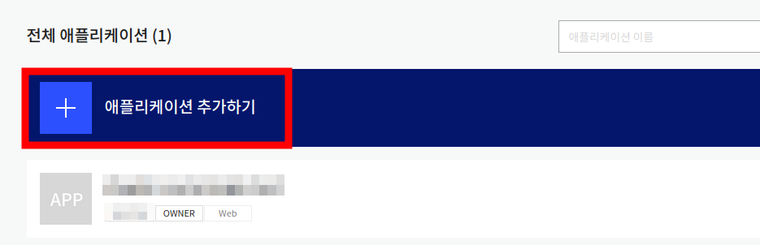

여기서는 새 애플리케이션을 만듭니다. '애플리케이션 추가하기' 버튼을 누릅니다.

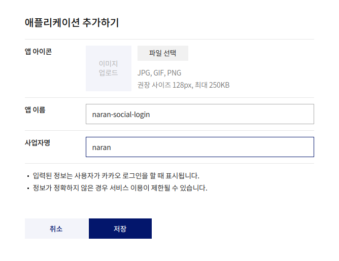

위 그림처럼 애플리케이션 정보를 입력을 묻는 대화창이 보입니다.

여기서 앱 이름으로는 'naran-social-login'을 선택하고,
사업자명으로는 'naran'을 입력하겠습니다. 각자 정확한 사업자명을 입력하세요.

개발 단계에서는 앱 아이콘까지는 입력하지 않아도 됩니다.

'저장' 버튼을 눌러 다음으로 진행합니다.

## 애플리케이션 설정 1

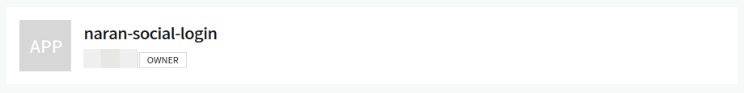

애플리케이션 목록에 방금 만들어진 항목이 보일 것입니다. 이름을 클릭하여 이동합니다.

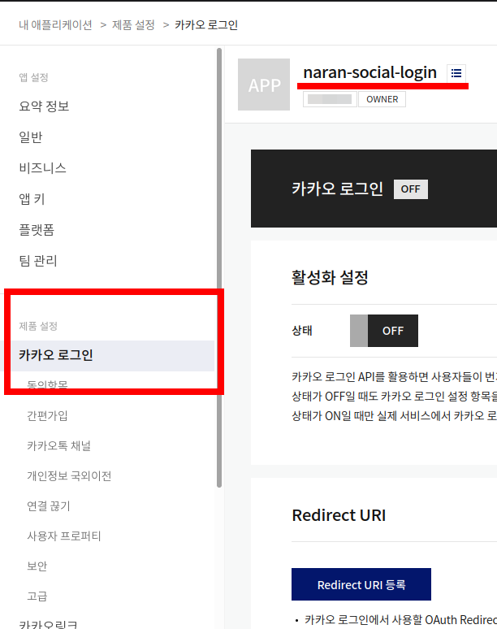

제품 설정 > 카카오 로그인으로 이동합니다.

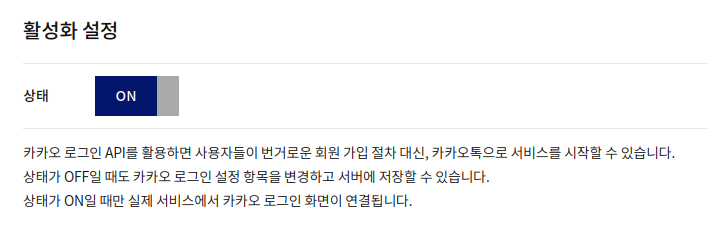

위 그림처럼 활성화 설정을 'ON'으로 변경합니다.

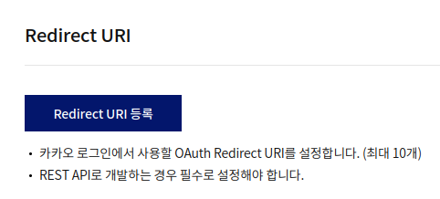

위 그림과 같이 Redirect URI 등록 버튼이 있습니다. 클릭합니다.

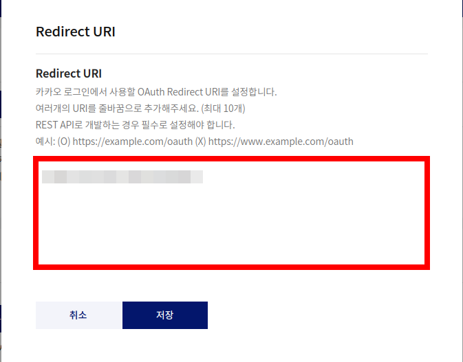

클릭하면 위 그림과 같은 대화창이 열립니다. 붉은 사각형으로 하이라이트한 곳에
관리자 > 설정 > 나란 소셜 로그인 > Kakao Redirect URI 부분을 복사하여 붙여 넣습니다.

저장 버튼을 눌러 다음으로 진행합니다.

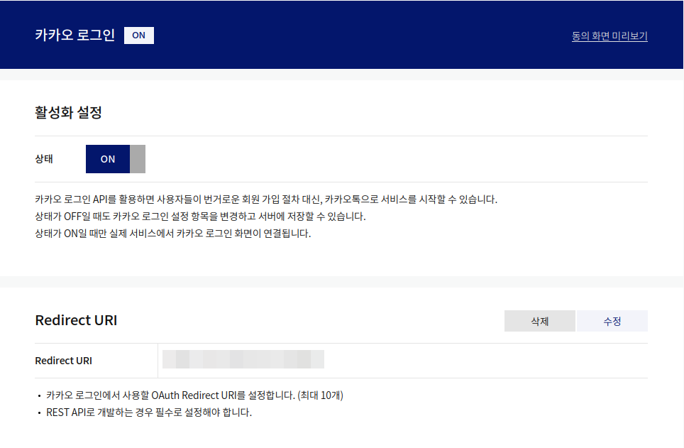

위 그림처럼 설정이 잘 반영되었는지 확인합니다.

## 애플리케이션 설정 2: 동의 항목

제품 설정 > 카카오 로그인 > 동의항목으로 이동합니다.

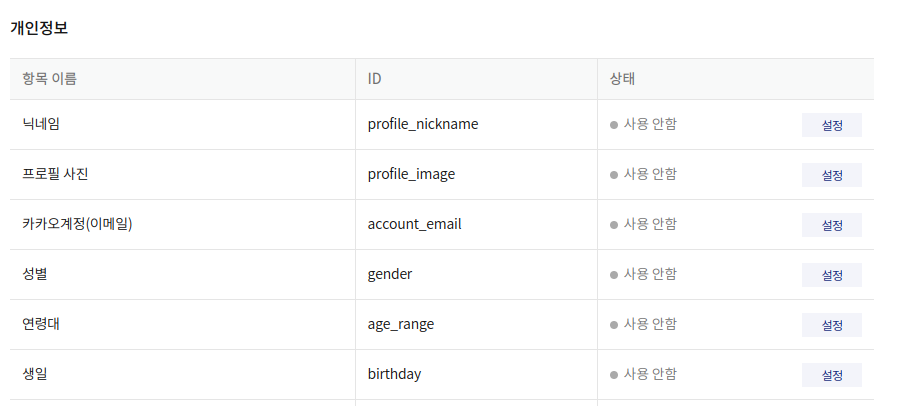

몇몇 개인 정보의 동의를 설정할 수 있습니다.

여기서 카카오 계정 (이메일)은 수집하는 것이 바람직하므로 '설정'을 눌러 진행합니다.

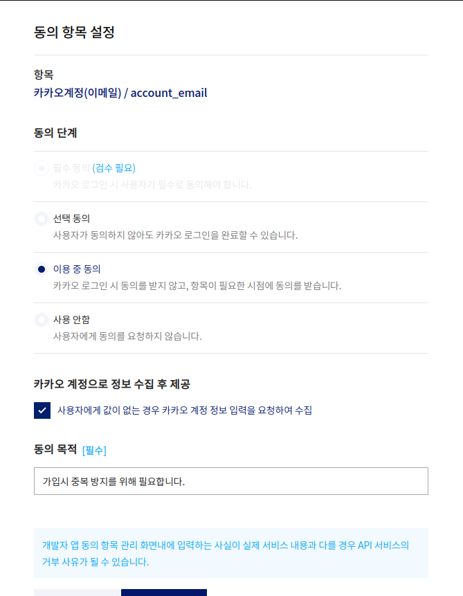

위 그림과 같은 설정 대화 상자가 열립니다.
일부 필드의 경우 검수가 필요하므로 당장은 선택할 수 없습니다.

'카카오 계정으로 정보 수집'에 체크는 선택적입니다.

추천하는 동의 항목은 아래와 같습니다.

* 닉네임: 필수 동의, 목적: 가입 처리 후 웹사이트에서 회원을 호칭하기 위한 목적입니다.
* 프로필 사진: 필수 동의, 목적: 가입 처리 후 웹사이트에서 회원의 아바타 사진을 동일하게 유지하기 위한 목적입니다.
* 카카오 계정 (이메일): 필수/선택/이용중 동의, 목적: 가입시 중복 방지를 위해 필요합니다. '카카오 계정으로 정보 수접' 체크.

완료되면 저장 버튼을 눌러 종료합니다.

## 애플리케이션 설정 3: 키와 비밀 키

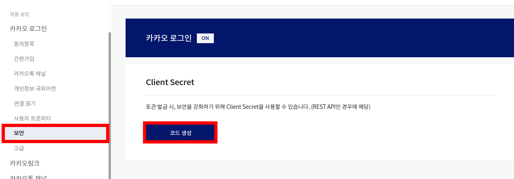

비밀 키는 제품 설정 > 카카오 로그인 > 보안 메뉴에서 확인할 수 있습니다.

만들어져 있지 않다면 '코드 생성' 버튼을 눌러 생성할 수 있습니다.

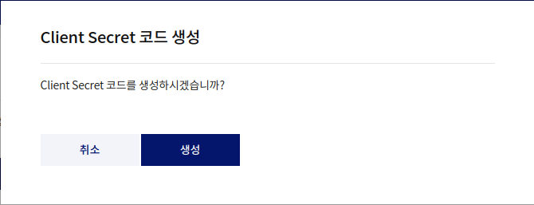

버튼을 누르면 다음처럼 확인을 묻는 창이 나옵니다. '생성' 버튼을 누릅니다.

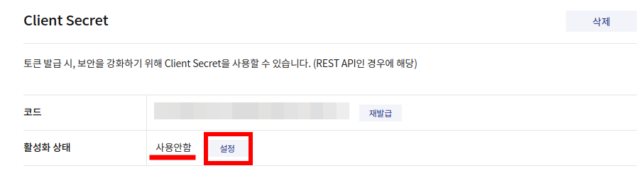

위 그림처럼 생성됩니다. 그러나 '사용안함' 상태가 되어 있어 바로 사용할 수 없습니다.
'설정' 버튼을 누릅니다.

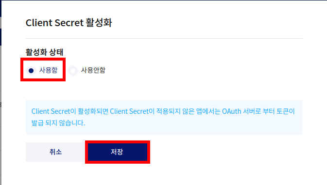

'설정' 버튼을 누르면 위 그림처럼 활성화 상태를 조절하는 대화창이 생성됩니다.
여기서 '사용함'을 선택하고, 저장 버튼을 누릅니다.

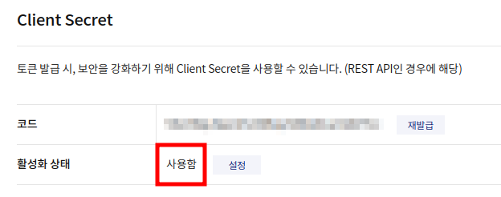

사용함 상태로 변경된 것을 확인합니다.

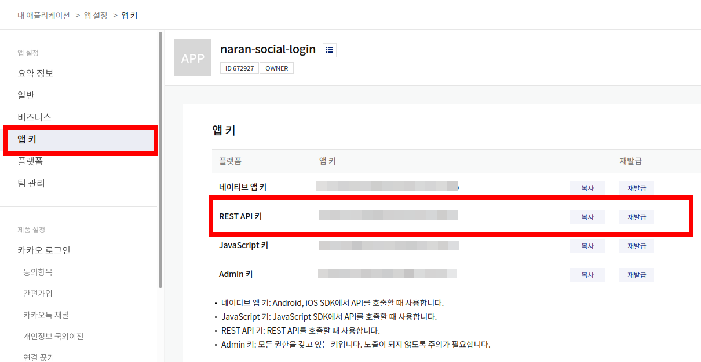

키는 위 그림처럼 앱 설정 > 앱 키 항목 또는 요약 정보에서 확인할 수 있습니다.
여러 키가 나열되어 있지만, 소셜 로그인에서 필요한 키는 'REST API 키' 입니다.

이 REST API 키와 Client secret 코드를 복사하여,
관리자 > 설정 > 나란 소셜 로그인 > 카카오 > REST API 키, Client Secret 에 각각 복사합니다.

## 설정 마무리
여기까지 하면, 로그인을 테스트해 볼 수 있는 셋업이 완료됩니다.
그러나 운영 사이트에서 제대로 소셜 로그인을 사용하려면 반드시 검수를 거쳐야 합니다.
