# 네이버 개발자 셋업

[네이버 개발자](https://developers.naver.com/main/) 사이트로 이동합니다.
로그인하지 않았다면 로그인 합니다.

## 앱 대시보드 접근

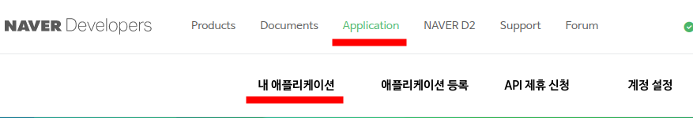

로그인 후, 메뉴의 'Application' > '내 애플리케이션'을 선택합니다. 

## 새 앱 생성

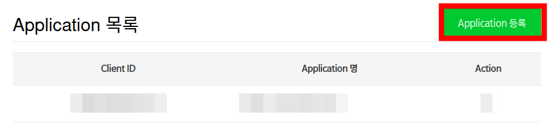

Application 목록에서 기존의 목록을 확인합니다. 여기서는 새로운 application을 등록합니다.
우측 상단의 녹색 'Application 등록' 버튼을 눌러 진행합니다.

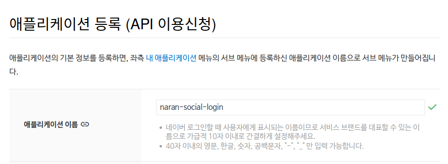

먼저 애플리케이션의 이름을 묻습니다. 여기서는 'naran-social-login'을 선택합니다.
입력란 아래 설명된 규칙에 맞춰 각자 원하는 이름을 선택하셔도 됩니다.

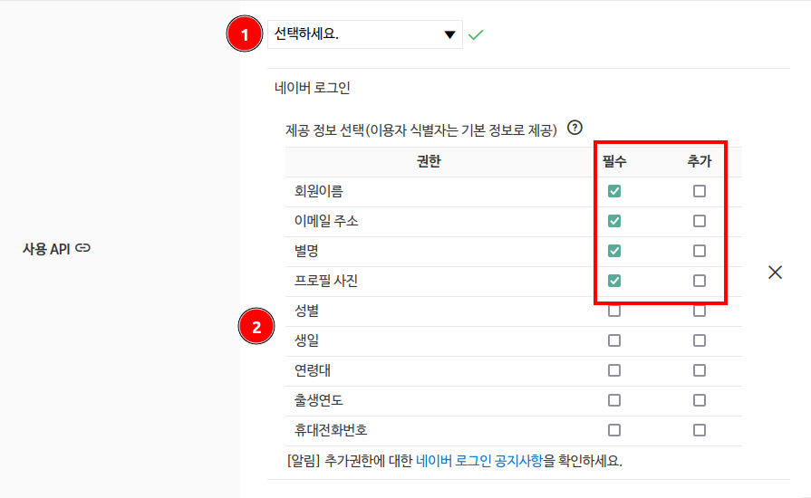

위 그림 (1)처럼 '사용 API'에서 '네이버 로그인'을 선택하면
(2)의 표가 생성됩니다. 여기서 그림처럼 '이메일 주소', '회원이름', '별명', '프로필 사진'을 필수로 선택합니다.

다만, 모든 회원의 데이터가 올바르게 잘 입력되어 있다고 가정하시면 안됩니다.
부가적인 회원 정보가 필요하다면 가입시 회원으로부터 명시적으로 받으셔야 합니다.
이유는 아래에서 설명하겠습니다.

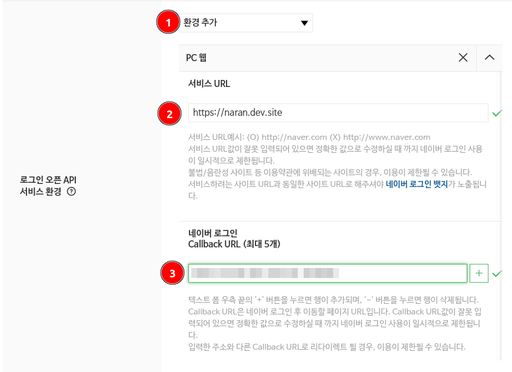

위 그림 (1)처럼 '환경 추가'에서 'PC 웹'을 선택합니다.
그리고 (2)에는 웹사이트의 URL을 적습니다. 여기서는 'https://naran.dev.site'를 입력했습니다.
각자의 웹사이트 주소를 정확히 입력하세요.

(3)에는 Callback URL을 입력합니다.
관리자 > 설정 > 나란 소셜 로그인 > Naver Redirect URI 부분을 복사하여 여기에 붙여넣기합니다.

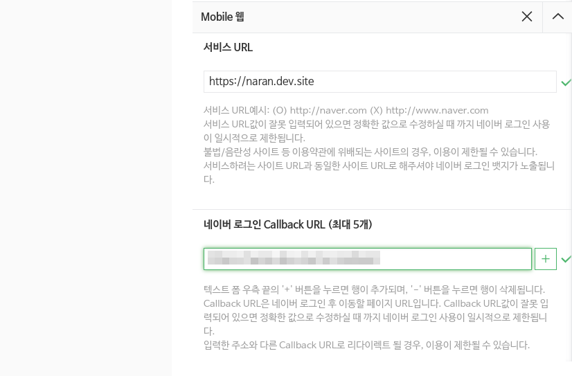

'모바일 웹' 항목을 추가하여 'PC 웹'과 동일한 내용을 입력합니다.

이제 화면 하단의 '등록하기' 버튼을 눌러 다음으로 진행합니다.

## 애플리케이션 설정

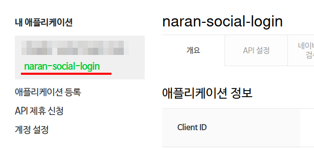

메뉴에서 방금 만들어진 'naran-social-login'이 선택되어 있는지 확인합니다.
아니라면 메뉴에서 내 애플리케이션 > 'naran-social-login'을 선택합니다.

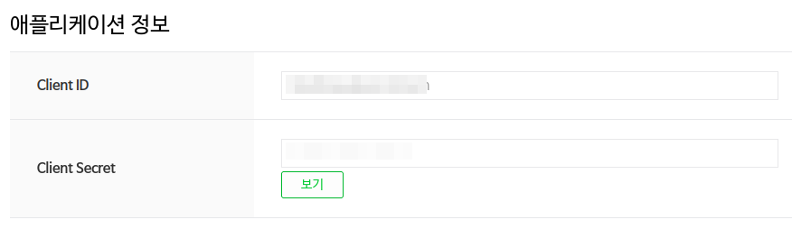

'개요' 탭의 '애플리케이션 정보' 섹션에서 Client ID, Client Secret을 확인하세요.
secret은 '보기' 버튼을 눌러야 노출됩니다.

Client ID와 Client Secret을 각각 복사하여,
관리자 > 설정 > 나란 소셜 로그인 > 네이버 > Client ID, Client Secret 에
각각 복사해 붙어 넣고 저장합니다.

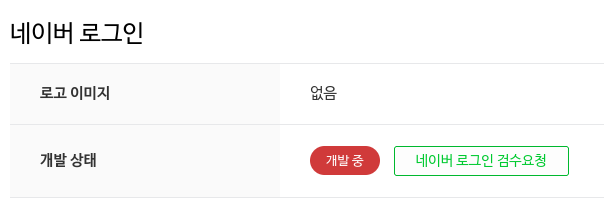

방금 만들어진 애플리케이션은 '개발 중'인 개발 상태를 가지고 있습니다.
웹사이트 제작이 완료되었다면 검수를 거쳐 활성화를 시켜야 모든 네이버 사용자를 대상으로 사용이 가능해집니다.

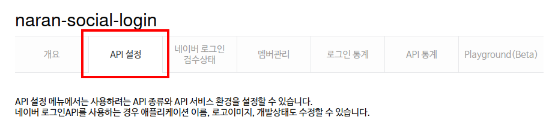

차후 설정 변경이 필요하면 'API' 설정 탭으로 이동하여 작업을 진행할 수 있습니다.

* 애플리케이션 이름
* 카테고리
* 사용 API
* 로그인 오픈 API 서비스 환경
  * 서비스 URL
  * Callback URL
  * 로고 이미지
* 정보제공동의창 미리보기
* 애플리케이션 삭제

등의 작업이 가능합니다.

## 추가 사항
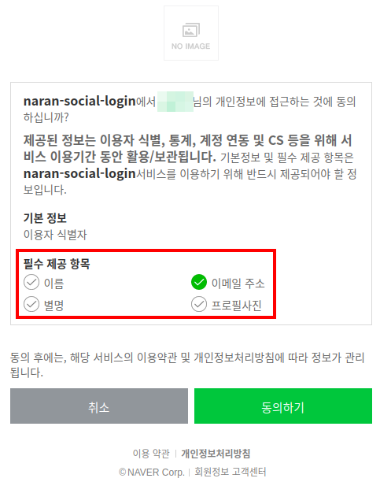

위 그림은 웹사이트에서 소셜 로그인을 시도하면 네이버에서 접속자를 위해 보여주는 동의 확인 페이지입니다.

비록 애플리케이션 설정에서 '필수' 항목으로 이름, 이메일 주소, 별명, 프로필 사진을 체크하였지만,
붉은 사각형으로 표시된 부분처럼 이메일 주소를 제외한 나머지는 체크를 해제한 상태입니다.
사용자는 동의 확인 페이지에서 자유롭게 어떤 항목을 제공할지 말지를 결정할 수 있습니다.

게다가 프로필 사진이나 별명 등은 애초부터 올바르게 작성되지 않은 경우도 많기 때문에,
소셜 로그인으로부터 이런 값들을 정확히 공급받는다고 기대해서는 안 됩니다.
