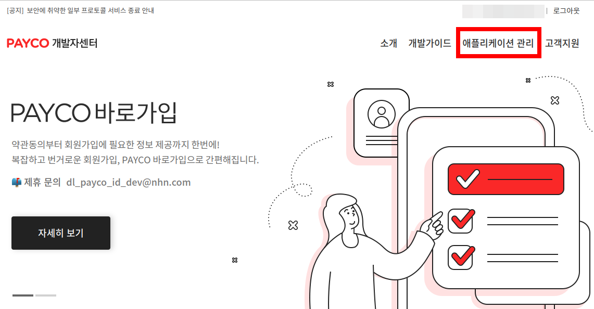
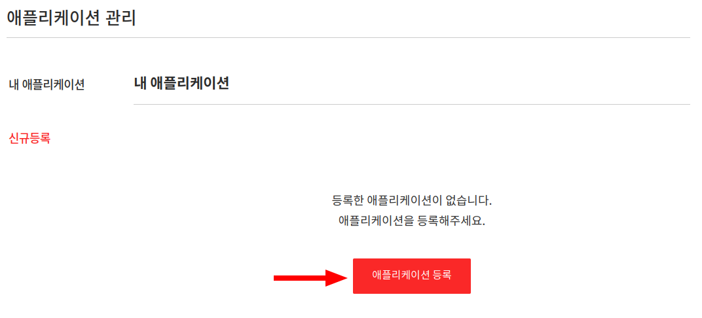
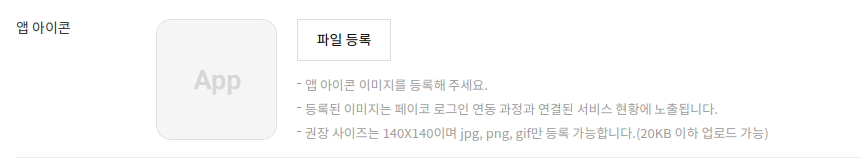
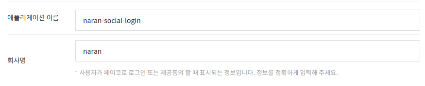
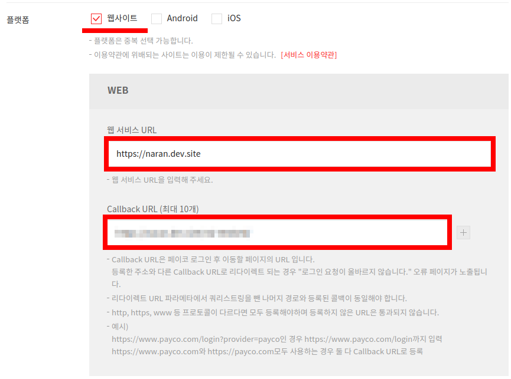
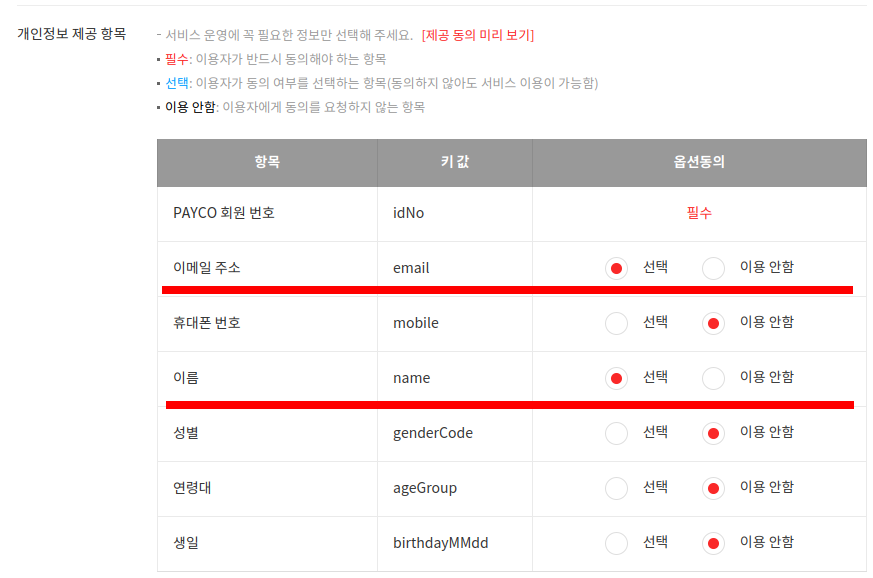
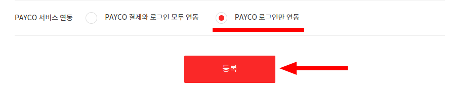
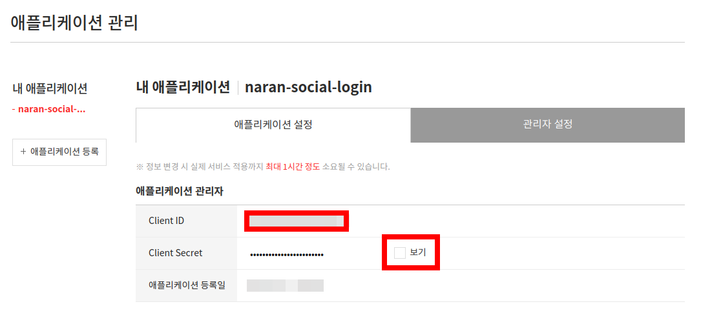

# 페이코 개발자 셋업

[페이코 개발자](https://developers.payco.com/) 사이트로 이동합니다.
로그인하지 않았다면 로그인 합니다.

## 앱 대시보드

로그인한 후 메뉴의 '애플리케이션 관리'를 찾아 이동합니다.

## 새 앱 생성

'애플리케이션 등록' 버튼을 눌러 새 앱을 생성합니다.

애플리케이션 정보를 입력합니다.

앱 아이콘은 당장은 입력하지 않습니다. 차후 정식 서비스 이용에는 필요할 수 있습니다.

애플리케이션의 이름은 'naran-social-login'으로 합니다. 각자 알맞는 이름을 선택하세요.
그리고 회사 이름은 'naran'이라고 합니다. 각자 정확한 회사 이름을 입력하세요.

플랫폼은 '웹사이트'만 선택해도 됩니다.

웹서비스 URL은 'https://naran.dev.site'로 입력합니다. 각자의 웹사이트 URL을 입력하세요. 

Callback URL은 관리자 > 설정 > 나란 소셜 로그인 > Payco Redirect URI 부분을 복사하여 여기에 붙여넣기합니다.

개인정보 제공 항목에서 위 그림처럼 이메일 주소와 이름을 선택으로 둡니다.
나머지는 이용 안함으로 놓아 둡니다.

페이코의 결제는 필요 없으므로 'PAYCO로 로그인 연동'을 선택합니다.

모든 사항을 점검하고 확인되었으면 '등록' 버튼을 눌러 진행합니다.

## 앱 정보 확인

애플리케이션 관리 화면에서 'naran-social-login' 앱을 선택합니다.

'애플리케이션 설정' 탭 > 애플리케이션 관리자 섹션에서
Client ID, Client Secret 항목을 확인할 수 있을 것입니다.

'보기' 버튼을 클릭하여 Client Secret을 노출 시킨 후, Client ID, Client Secret을 복사하여
관리자 > 설정 > 나란 소셜 로그인 > PAYCO > Client ID, Client Secret 에 각각 붙여넣기 하고
저장합니다.

## 추가 사항