# 트위터 개발자 셋업

[트위터 개발자](https://developer.twitter.com/en) 사이트로 방문하여 로그인합니다.
로그인되었으면 [Developer Portal](https://developer.twitter.com/en/portal/dashboard) 로 이동합니다.

## 새 프로젝트 만들기
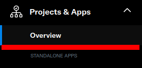

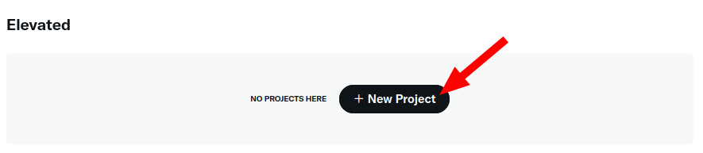

Project & Apps 메뉴를 눌러 이동합니다.
화면의 Create Project 버튼을 눌러 새 프로젝트를 생성합니다.

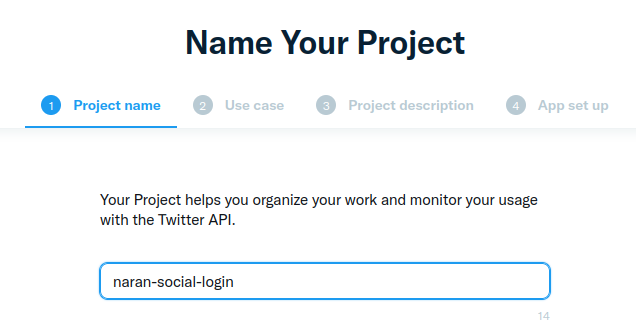

이 예제에서는 이름을 'naran-social-login'이라고 합니다. 각자 프로젝트 이름을 알아보기 쉽게 정하십시오.
우측 하단의 Next 버튼을 눌러 다음 단계로 진행합니다.

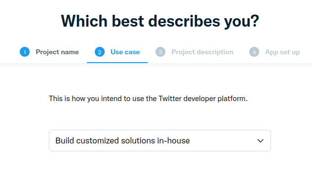

API 사용 목적을 묻습니다 적당히 'Build customized solutions in-house'를 선택했습니다.
다른 적합한 목적이 있다면 다른 목적을 선택해도 상관없습니다. 우측 하단의 Next 버튼을 눌러 다음 단계로 진행합니다.

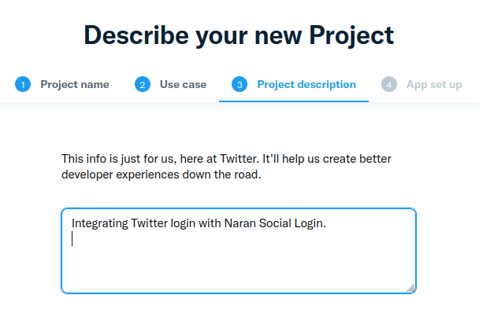

다음은 프로젝트를 설명하는 입력란입니다.
여기서는 'Integrating Twitter login with Naran Social Login.'라고 입력합니다.
우측 하단의 Next 버튼을 눌러 다음 단계로 진행합니다.

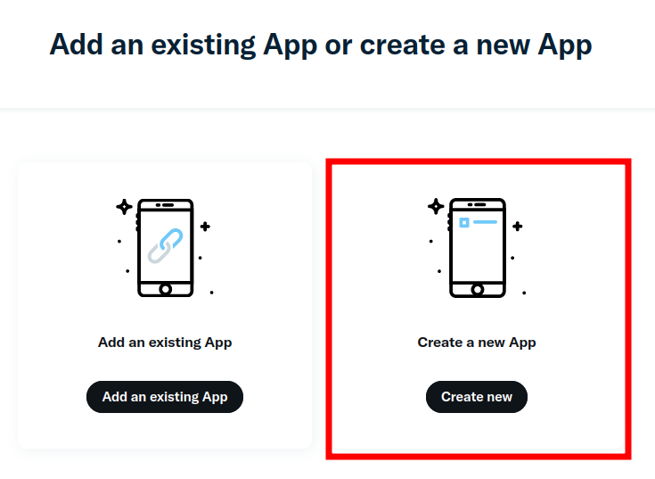

새로운 앱이므로 'Create a new App'을 선택합니다.

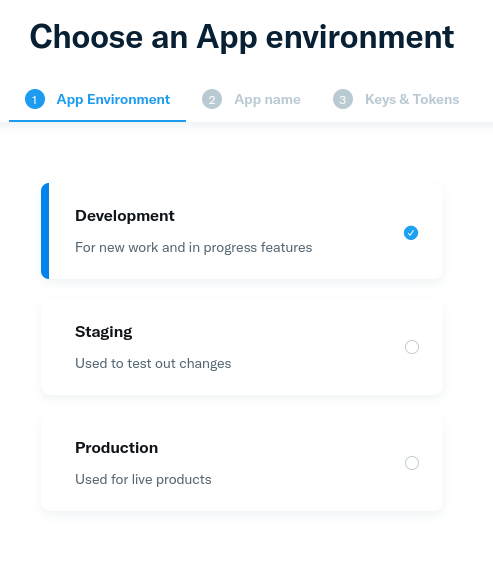

앱 환경을 설정하는 단계입니다. 웹사이트가 완전히 구축되어 운영중인 상태라면 'Production'으로 설정해야 합니다.
다만 여기서는 'Development'를 선택합니다.

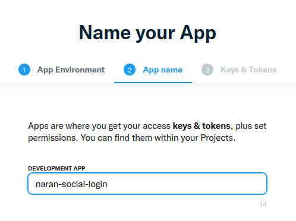

앱 이름을 설정합니다. 프로젝트와 동일하게 'naran-social-login'이라고 설정하겠습니다.

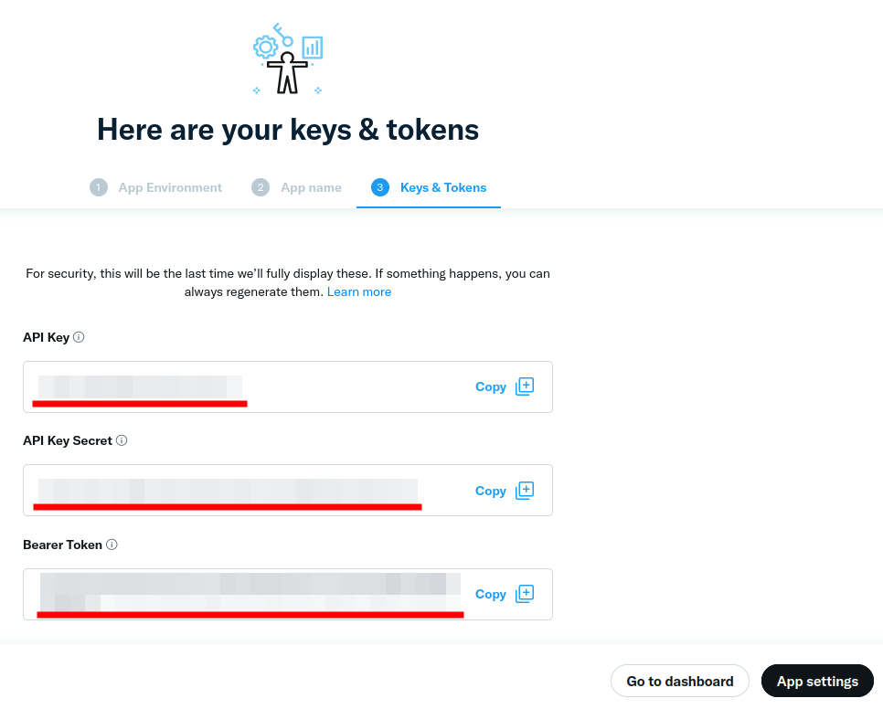

API Key, API Key Secret, Bearer Token 을 발급받습니다.
보안상 이 화면을 벗어나면 다시는 각각의 전문을 보여주지 않는다고 하니,
각각 키를 잘 복사하여 다른 안전한 곳으로 옮겨 적으시기 바랍니다.
이 키를 잃어버리면 토큰을 다시 발급받아야만 합니다.

키의 사본을 잘 보관하였으면, 이제 API Key와 API Key Secret을
관리자 > 설정 > 나란 소셜 로그인 > 트위터 > API Key, API Key secret 에
각각 복사해 붙어 넣습니다.

이제 우측 하단의 'App Settings' 버튼을 눌러 다음으로 이동합니다.

## 앱 설정

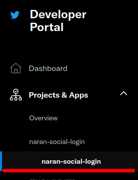

좌측 메뉴에서 Project & Apps naran-social-login > naran-social-login을 선택합니다.
이전에 프로젝트 이름과 앱 이름을 naran-social-login 이 아닌 다른 것을 선택했다면 직접 선택한 프로젝트와 앱 이름을 찾아보세요.

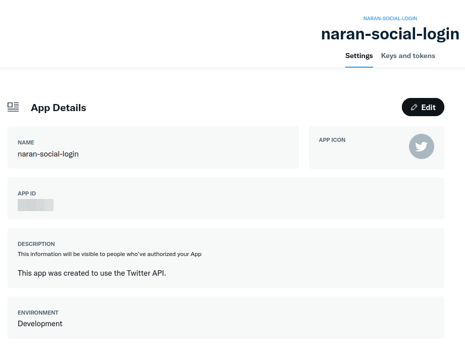

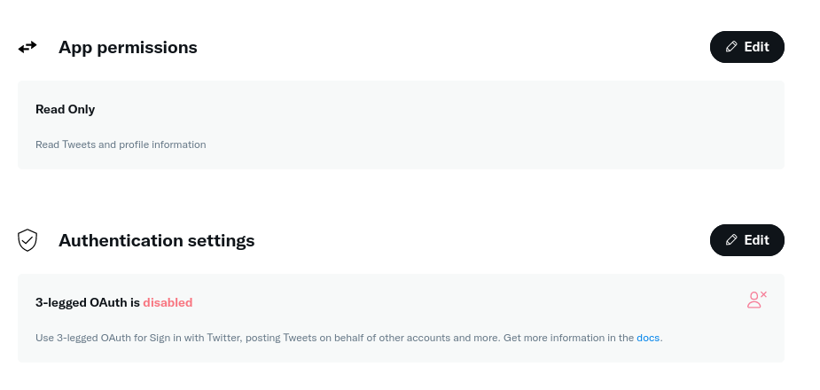

위 두 그림과 같은 화면이 나올 것입니다.
프로젝트 이름 (name), 설명 (description), 환경 (environment) 설정이 위에서 입력한 것과 동일한지 확인하세요.

App permissions 에서는 위 그림처럼 Read Only로 놔 두어도 무방합니다.

Authentication settings 에서는 현재 3-legged Oauth is *disabled*라고 되어 있습니다.
소셜 로그인은 이 기능이 필요하기 때문에 활성화해야 합니다. 'Edit' 버튼을 눌러 진행합니다.

## OAuth 활성화

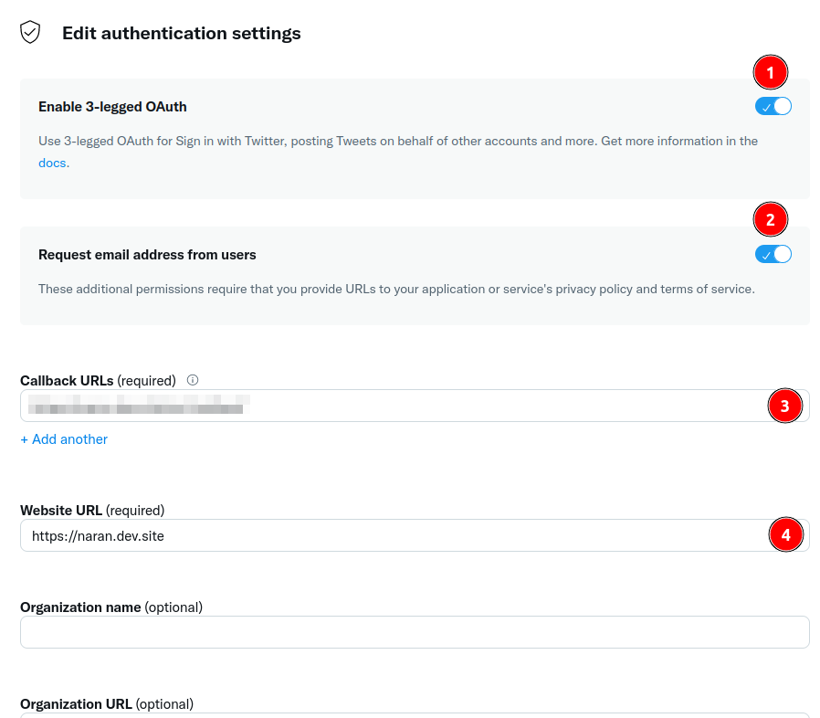

위 그림처럼 진행하면 됩니다.

(1), (2)는 활성화합니다.

(3)은 Redirect URI를 입력합니다.
관리자 > 설정 > 나란 소셜 로그인 > Twitter Redirect URI 부분을 복사하여 여기에 붙여넣기합니다.

(4)는 웹사이트 URL을 입력합니다. 여기서는 'https://naran.dev.site'를 예시로 적었습니다.
각자의 정확한 URL을 복사하여 예시처럼 붙여 넣어 주세요.

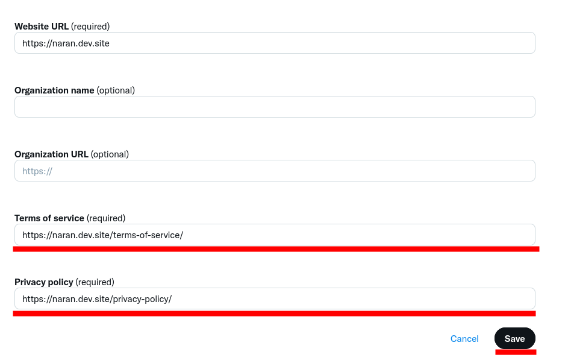

마지막으로 Terms of service, Privacy policy 페이지 URL을 입력해야 'Save' 버튼이 활성화됩니다.
여기서는 'https://naran.dev.site/terms-of-service/'
'https://naran.dev.site/privacy-policy/'를 각각 입력하였습니다.

당장은 위 주소를 임시로 입력해도 되지만, 'development'에서 'production' 환경으로 이동하려면
위 정보들이 정확해야 검수를 통과할 수도 있습니다.

저장 버튼을 눌러 작업을 완료합니다.
앱 정보 페이지에서 수정한 내용이 모두 올바른지 다시 확인합니다.
